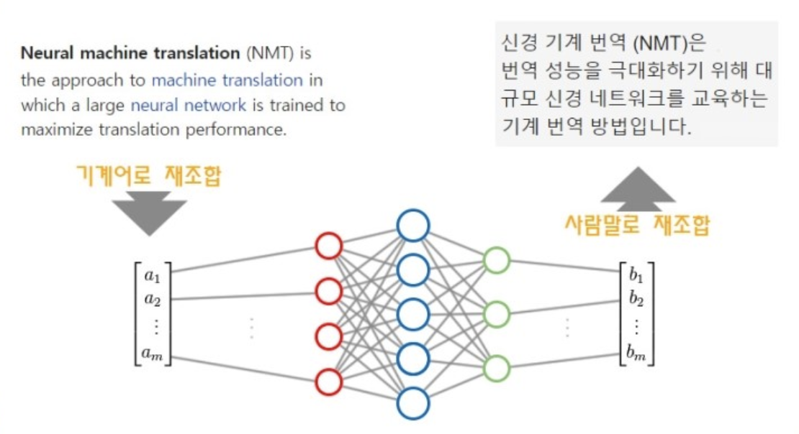
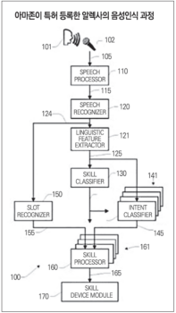
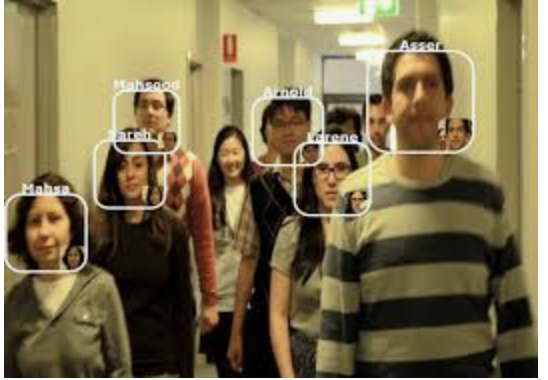
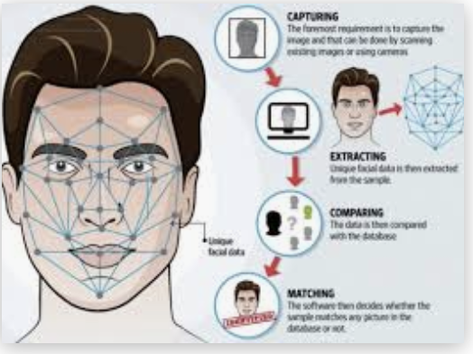
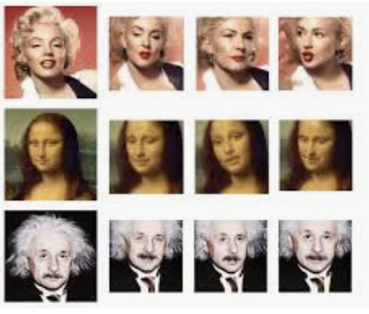

# 인공지능 사관학교 프로코스 과제 목차

## 1주차 과제(2020.05.21)

* 언어
  - 번역
    기계로 언어를 번역하는 전통적인 방법은 문장의 문맥대신 단어 또는 구를 중심으로 단어를 변환하는 것입니다. 통계적인 방법을 기반으로 하였습니다.
    하지만 AI를 사용한 언어번역는 기존의 전통적인 방법과는 조금 다릅니다.
    
    문장을 벡터라는 숫자들의 모임으로 바꾸어 표현하는것이 인공지능 번역입니다.
    글자를 백테(즉 숫자)로 조정하여 분해하고 이를 분류하여 단어별 번역하고 이를 합치면서 문장별로 의미를 파악하여 번역합니다. 
    분해하고 분류하고 합치는 과정을 신경망이하고 이를 잘 구성해줘야 한다.

    

  - 시중 제품
     구글번역기,
* 음성
  - AI를 통해 음성을 인지 하는과정은 매우 복잡하고 어렵다. 당장은 이해하기 어려운것같다.
    
    
    다음과 같은 과정을 통해서 인식이 된다고 한다.

  - 타인의 목소리 흉내
    음성인식을 통해서 목소리를 학습시키고 이를 통해서 타인의 음성을 만들어낼수있다고 한다. 
    [블로그](http://melonicedlatte.com/machinelearning/2018/07/02/215933.html)

* 이미지
    - 이미지처리는 CNN,GAN등을 이용해서 객체 감지부터 인식까지를 할수있다. 
    이를 통해서 얼굴인식 및 물체 인식 등을 다양하게 사용되고 있다. 
    또한 보안 인식에도 사용된다. 얼굴감지와 그래픽스를 통한 3D얼굴도면을 생성하여 보안적인 측면에 얼굴인식을 이용할수있다. 
    또 다르게 사용된 예시를 보면 영상을 만들어 자연스러운 가짜 영상을 만들수있다. 
    
    
    
    
* 자율주행
    - 자율주행은 각종 센서를 이용하여 차선 및 차량에 관한 정보를 인지한다. 다음으로 정밀, 측위 지도를 활용하여 경로를 선택, 차량 간 통신등을 주변 도로 및 상황 정보를 획득한다. 센서로 수집하는 여러 정보는 현 시점에선 부정확하다. 따라서 V2X 통신 등을 통해 이를 보완하는 것이다. 

    - 위 단계는 다양한 센서를 통한 인지된 환경을 자동차가 자율 주행을 위해 판단하는 기술이다. 카메라를 활용한 차선 유지 보조시스템, 교통표지판 인지시스템, 보행자 회피시스템 등의 판단기능을 수행한다. 특히 도심지에서 보행자, 신호등, 돌발상황 등에 대처하는 복합적 판단이 요구된다. 이를위해 FCW(전방충돌 경고) UWS(근거리 물체경고),SOWS(졸음운전 방지),DWS(졸음운전 방지),LDW(차선이탈 경고),AEB(자동비상 제동) 등의 기술들이 사용되고 있다. 

      - 제품으로는 테슬라, 우버 등이 있다. 

#### 관심분야
    얼굴인식과 그래픽스를 이용한 핸드폰 어플등 그래픽을 이용한 인공지능과 그래픽을 이용한 분야에 관심이있다. 
    결국 이분야는 ar,vr등 다양한 분야 그리고 자율주행등에 사용될것으로 생각되기 때문이다.
    동영상 시대를 지나 직접 경험하는 시대가 올것이라고 생각한다.